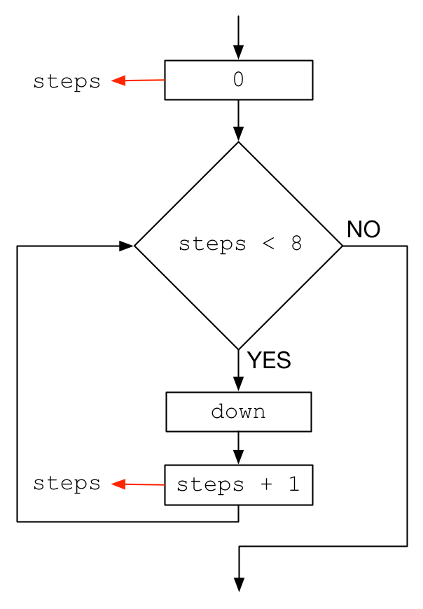

# CCA Programming & Electronics, Fall 2016, Wednesday section

This course repository contains homework assignments, useful guides, and code for "Programming & Electronics" at CCA, Spring 2017.

Also included in this repository is the official [course syllabus](syllabus.pdf).

### Week 1: Wednesday, September 7, 2016

Lecture:
- Introductions
- What is programming?
- Goals & course details

Hands-on activities:
- Human Embodiment of Programmer & Robot
  - Programs generally run line-by-line.
  - While loops, if statements, and functions break that up.

#### Building Blocks of Code

In today's class, we explored the four building blocks of code: functions, variables (memory), `if` statements (conditions), and `while` loops.

*Functions*

A function is like a recipe. It describes what sequence of actions to take in order to get some desired result. Functions can be built-in, like `down`, `up`, `left`, and `right` in the Rudy the Red Dot puzzle game.

Getting the robot to run a recipe is pretty simple: in parentheses `()` after the function name, tell it what parameters to use. If ther are no parameter, leave the parentheses empty, but *don't omit the parentheses* or you'll just be referring to the recipe, not telling the computer to actually execute the recipe. For example:

- `down;` -- tells the computer "hey, remember the function we called `down`?"
- `down();` -- tells the computer "hey, remember the function we called `down`? **RUN IT**"

The simplest functions are sequences of single built-in functions. For example:

```
function downThreeTimes() {
  down();
  down();
  down();
}
```

The `downThreeTimes` function executes the `down` function three times; it's pretty basic. But remember, this is telling Rudy *how to run* the `downThreeTimes` recipe, it doesn't *tell Rudy to run the recipe*. To run it, you'd need to add `downThreeTimes();` to your code.

Here's the flowchart for the function `downThreeTimes`:


*Memory and Variables*

Memory is stored in the equivalent of a table. It might look something like this:

| name  | value  |
| ----- | ------ |
| color | "blue" |
| steps | 3      |

You can create new entries in the vable using the `var` keyword, like these two lines, which create the memory table above:

```
var color = "blue";
var steps = 3;
```

We didn't discuss `var` much in class, but you only need it the first time you use a variable. If you read it or update it later, you can't have `var` again.

A super common use of variables is to store a value for later use. For example:

```
down();
var c = getColor();
down();
right();
setColor(c);
```

Or, equivalently, in flow-chart:


The red arrows indicate data going to or from memory, using the given variable name. The `getColor` function, for example, gives us back a "color" that we are storing the the variable named `c`. Then, later, the `setColor` function uses `c` as its color parameter.

Rememeber that setting a variable to the result of some function doesn't set up any kind of pemanent relationship: that function is run once, and the value you get back at that very moment is then saved in memory.

*`if` statements*

`if` statements let you control the flow of your code so that it doesn't just sequentially run every line of code you have. The typical `if` statement might look something like this:

```
if (getColor() == "blue") {
  up();
} else {
  down();
}
```

Equivalently, in flow-chart:


The `else` branch is optional. The curly-brace characters, `{}`, enclose all the lines of code that are part of the **YES** or **NO** branches of the `if`.

*`while` loops*

`while` loops are like `if` statements, but repeated. In other words, if the condition is true, not only is the body run, but the loop repeats itself and checks the condition again. A typical `while` loop might look something like this:

```
while (getColor() != "red") {
  down();
}
```

Equivalently, in flow-chart:


By combining a while loop with some memory, you can keep track of the number of times something has happened, and thus easily repeat a block of code a given number of times. For example:

```
var steps = 0;
while (steps < 8) {
  down();
  steps = steps + 1;
}
```

Equivalently, in flow-chart:



Whew. That's all we did today! If you're stuck on anything, ask a fellow student or email [me](mailto:jzamfirescupereira@cca.edu) or [Caroline](mailto:caroline.crandall@cca.edu) for help!

Here are some inspirational videos to get you excited for our class if you're not already:
- Basic robots
  - [Coffee-can robot](http://www.youtube.com/watch?v=b0mIshBIbvI#t=24)
  - [Tree-climbing robot](http://www.youtube.com/watch?v=zkpH1BjD6Wc)
  - [Self-balancing robot](http://www.youtube.com/watch?v=Tw9Jr-SPL0Y)
  - [Insect robot](http://www.youtube.com/watch?v=tOsNXg2vAd4#t=120)
  - [Treadbot](http://www.youtube.com/watch?v=YblSltHDbIU)
  - [Velociraptor robot](http://www.youtube.com/watch?v=lPEg83vF_Tw)
- Installations
  - [The Bay Lights](http://thebaylights.org/)
  - [Murmur Wall](http://www.future-cities-lab.net/projects/#/murmurwall/)
  - [Floating Couch](http://vimeo.com/72826106)
  - [Wooden Segment Mirror](https://www.youtube.com/watch?v=BZysu9QcceM#t=36)
  - [Generative design](https://www.youtube.com/watch?v=pNkz8wEJljc)
- Art & Music bots
  - [Textile weaving](https://vimeo.com/71044541)
  - [ReacTable](https://www.youtube.com/user/marcosalonso)
  - [Projection mapping](https://www.youtube.com/watch?v=czuhNcNU6qU)
  - [Laser harp](http://www.youtube.com/watch?v=sLVXmsbVwUs#t=20)
  - [Cubli: Floating Cube](https://www.youtube.com/watch?v=n_6p-1J551Y)
  - [Arc-o-matic](http://vimeo.com/57082262#at=130)
  - [Robo Faber](http://vimeo.com/78771257)
  - [Eggbot](https://www.youtube.com/watch?v=w4cdbV2oaEc)
- Drink-makers
  - [Textspresso](http://www.youtube.com/watch?v=kx9D74t7GD8#t=89)
  - [The Inebriator](http://www.youtube.com/watch?v=WqY7fchs7H0)
- Computer Numerical Control (CNC)
  - [Shapoko / tinyg](http://www.youtube.com/watch?v=pCC1GXnYfFI#t=11)
  - [Makerbot Replicator](http://www.youtube.com/watch?v=NAbiAzYhTOQ)
- Vacuuming
  - [Roomba](https://www.youtube.com/watch?v=0DNkbZvVYvc)

[Homework for Week 1](hw/week1.md)
