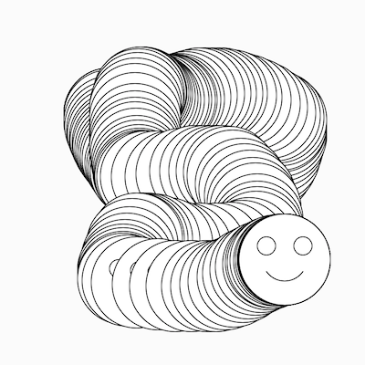
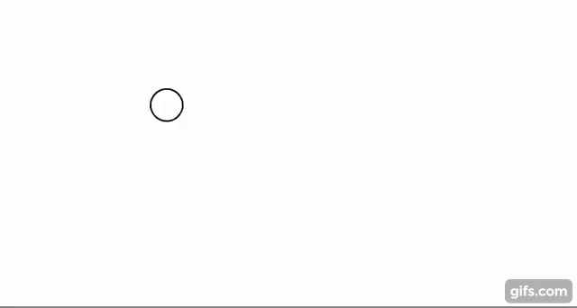
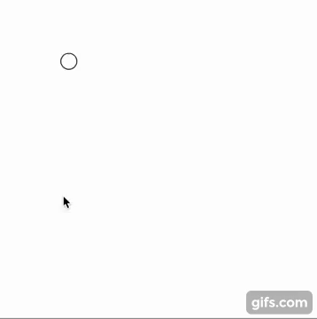

### Homework 2 (due Sunday, January 29, 2016)

Complete the exercises below on variables and animation and submit them in your [homework repository](../github-guide.md) (label these sketches `sketch-1.js` etc.).

As a reminder, **please email us if you get stuck!** We are on email more than is probably healthy, and we are happy to answer questions. Also please make use of the help available to you at CCA: You can get hands-on, in-person help by stopping by the Hybrid Lab and speaking with a lab monitor, or by making an appointment with one of the [Software or Math/Science coaches at the Learning Resources Center](https://www.cca.edu/students/resources/appointments).

#### Programming Practice (due Sunday)

1. Complete your moving smiley face. To be specific, draw a smiley face that follows the mouse -- your sketch should do this by drawing the face at a location determined using `mouseX` and `mouseY` variables like we did in class. Your sketch should produce something that looks like this:

   

2. Modify your smiley-face sketch from #1 so that (a) the [background](http://p5js.org/reference/#/p5/background) gets cleared each frame before drawing the face, and (b) the happiness of the smile tracks `mouseX` -- sad on the left, happy on the right -- like in this anigif:
   
   

3. Animate a single circle, starting at 100, 100, and moving right 3 pixels each frame. Should look something like this, though note that this gif repeats automatically (and your code doesn't have to). *Note that you will need a variable defined outside of `setup` and `draw` in order to track location across frames. See today's notes for the example we wrote in class together.*
  
   

4. Modify your single circle code from #3 above so that the circle bounces at the **right** edge of the canvas and reverses direction. *You may need an extra variable to keep track of the direction of the circle's motion!*
  
5. Make the circle also bounce on the **left** side of the canvas.

6. **Challenge**: Add a [`mousePressed()`](http://p5js.org/reference/#/p5/mousePressed) function that immediately moves the circle to the location of the mouse click. (Just as p5.js automatically runs `setup()` when you start your sketch, and runs `draw()` for every frame, it also runs `mousePressed()` whenever the user clicks the mouse.)

   Your sketch may look something like this:
   
   

#### Tutorial (due Tuesday)

Watch Daniel Shiffman's video tutorials about [`while` and `for` loops](https://www.youtube.com/watch?v=cnRD9o6odjk) and [nested loops](https://www.youtube.com/watch?v=1c1_TMdf8b8).

Then, answer the following questions in a 'questions.md' file in your repository for week 2's homework:

1. What is the difference between a `for` loop and a `while` loop?

1. What are the four parts of a `for` loop? What do they do?

2. What does "nested" mean in the context of nested loops?

