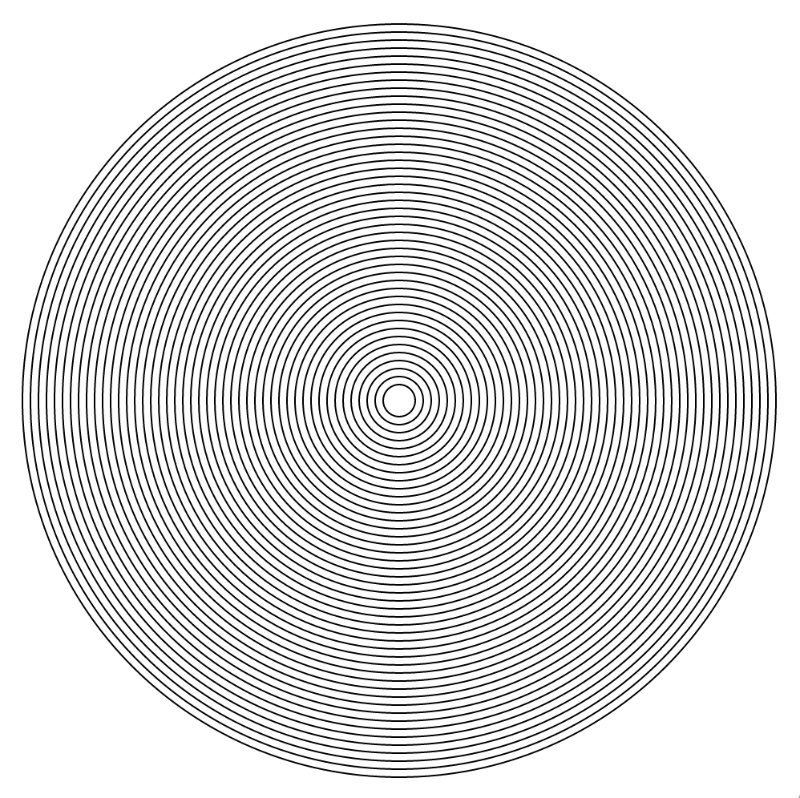
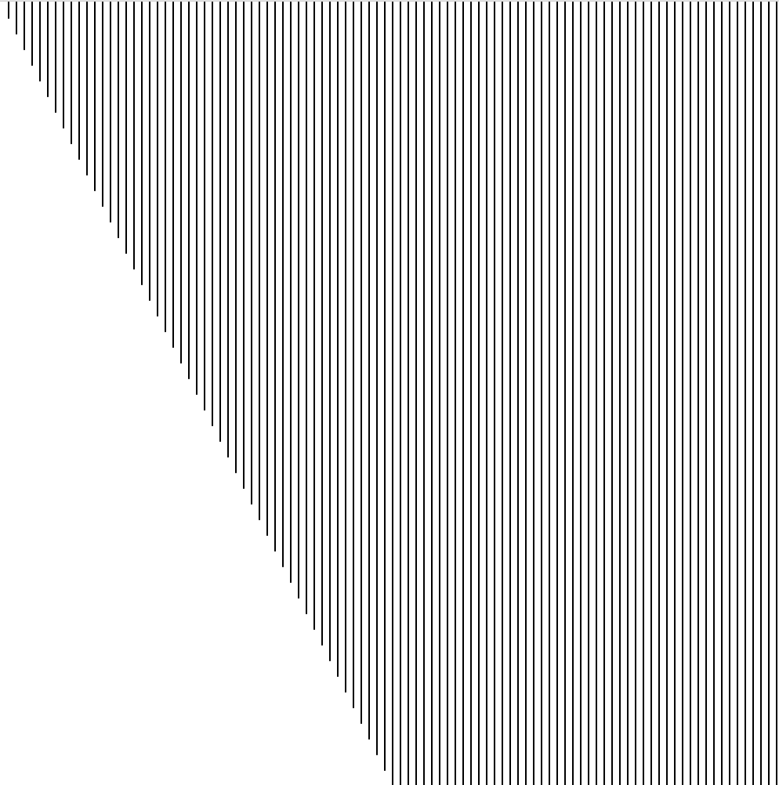
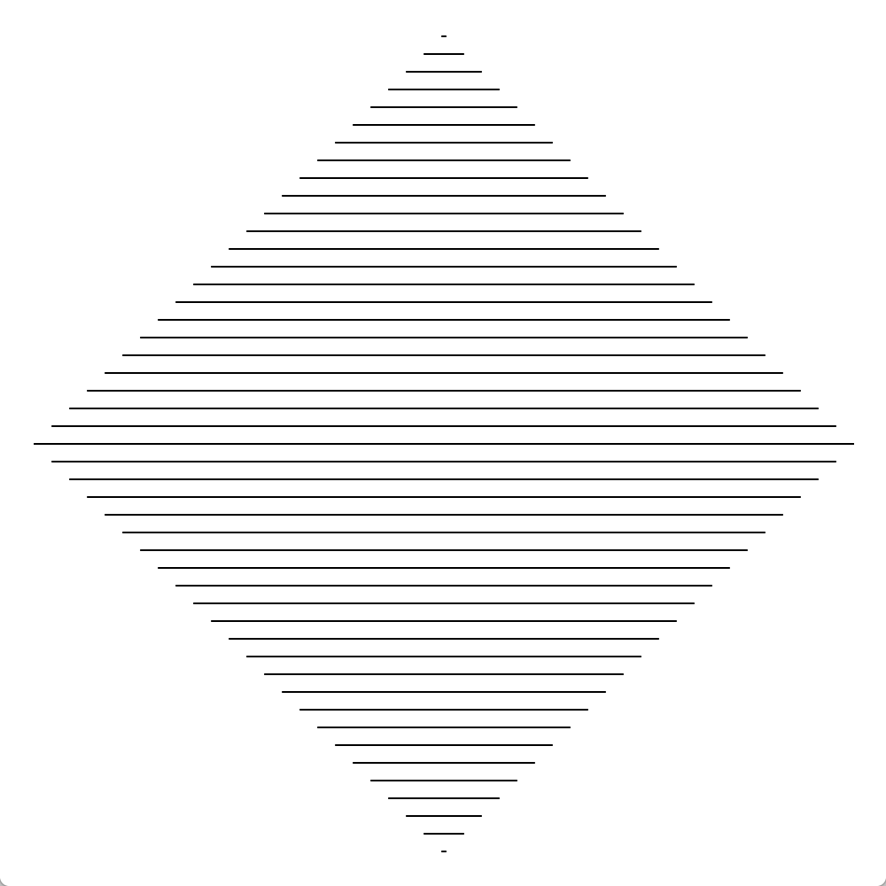
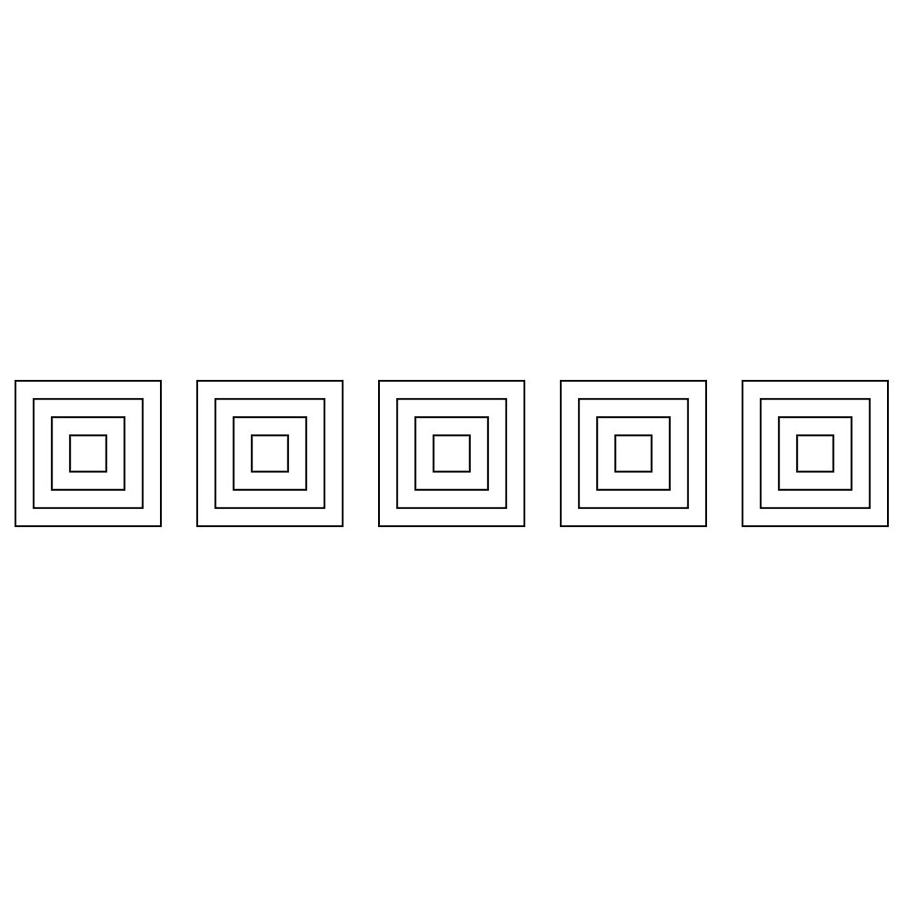

### Homework 2 (due Sunday, January 29, 2016)

Complete the loop exercizes below and submit them in your [homework repository](../github-guide.md) (label these sketches `sketch-1.js` etc.).

As a reminder, **please email us if you get stuck!** We are on email more than is probably healthy, and we are happy to answer questions. Also please make use of the help available to you at CCA: You can get hands-on, in-person help by stopping by the Hybrid Lab and speaking with a lab monitor, or by making an appointment with one of the [Software or Math/Science coaches at the Learning Resources Center](https://www.cca.edu/students/resources/appointments).

#### Programming Practice 

- **Assignment**: Reproduce all five of the sketches below.

1. A cone of lines. (Follow the method we used in class -- start by finding the pattern in the coordinates of the first few lines!)
   
   

2. Concentric circles. Remember that drawn shapes are filled by default -- look into the `noFill` command in the [P5js reference](http://p5js.org/reference).
   
   

3. Doubles. It's ok if the lines draw off the screen.
  
   

4. Diamond. You might need more than one loop, like the example we did together in class.
  
   

5. Art Deco. You'll need a nested loop for this one. One way to think about it: first write a single loop that draws concentric rectangles around a center point. Then, figure out the pattern in the center points from one rectangle set to the next. Then, write your "outer" loop so that the center points follow the pattern you found.
   
   