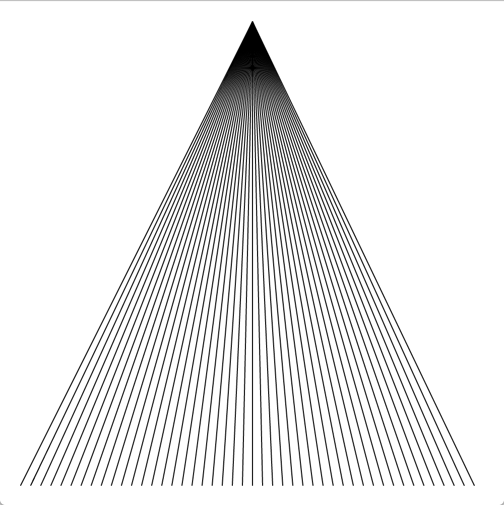

### Homework 3 (due Sunday, February 5, 2017)

Complete the loop exercises below and submit them in your [homework repository](../github-guide.md) (label these sketches `sketch-1.js` etc.).

As a reminder, **please email us if you get stuck!** We are on email more than is probably healthy, and we are happy to answer questions. Also please make use of the help available to you at CCA: You can get hands-on, in-person help by stopping by the Hybrid Lab and speaking with a lab monitor, or by making an appointment with one of the [Software or Math/Science coaches at the Learning Resources Center](https://www.cca.edu/students/resources/appointments).

#### Tutorials for Review

Some of you requested a additional references to review the material we've covered so far. For extra help, I recomment watching some of [Daniel Shiffman's great video tutorials](https://www.youtube.com/playlist?list=PLRqwX-V7Uu6Zy51Q-x9tMWIv9cueOFTFA) on the topics we've covered so far.

Especially useful tutorials might be:
- Variables in p5.js [part 1](https://www.youtube.com/watch?v=RnS0YNuLfQQ&list=PLRqwX-V7Uu6Zy51Q-x9tMWIv9cueOFTFA&index=5) and [part 2](https://www.youtube.com/watch?v=Bn_B3T_Vbxs&list=PLRqwX-V7Uu6Zy51Q-x9tMWIv9cueOFTFA&index=6)
- [The `map()` function](https://www.youtube.com/watch?v=nicMAoW6u1g&list=PLRqwX-V7Uu6Zy51Q-x9tMWIv9cueOFTFA&index=8)
- [The `random()` function](https://www.youtube.com/watch?v=nfmV2kuQKwA&list=PLRqwX-V7Uu6Zy51Q-x9tMWIv9cueOFTFA&index=9)
- [Conditional Statements](https://www.youtube.com/watch?v=1Osb_iGDdjk&list=PLRqwX-V7Uu6Zy51Q-x9tMWIv9cueOFTFA&index=10)
- [The Bouncing Ball](https://www.youtube.com/watch?v=LO3Awjn_gyU&t=269s&list=PLRqwX-V7Uu6Zy51Q-x9tMWIv9cueOFTFA&index=11)
- [Else, else if, **and** and **or**](https://www.youtube.com/watch?v=r2S7j54I68c&list=PLRqwX-V7Uu6Zy51Q-x9tMWIv9cueOFTFA&index=12)

Hopefully these feel like review. If not, [let me know](mailto:jzamfirescupereira@cca.edu)!

#### Programming Practice (due Sunday)

- **Assignment**: Reproduce the sketches below.

1. A cone of lines. (Follow the method we used in class -- start by finding the pattern in the coordinates of the first few lines!)
   
   

2. Concentric circles. Remember that drawn shapes are filled by default -- look into the `noFill` command in the [p5.js reference](http://p5js.org/reference).
   
   

3. Doubles. It's ok if the lines draw off the screen.
  
   

4. Diamond. You might need more than one loop.
  
   

5. **Optional Challenge:** Art Deco. You'll need a nested loop for this one. One way to think about it: first write a single loop that draws concentric rectangles around a center point. Then, figure out the pattern in the center points from one rectangle set to the next. Then, write your "outer" loop so that the center points follow the pattern you found.
   
   
   
#### Tutorials on objects and functions (due Tuesday)

Watch Daniel Shiffman's tutorials about [JavaScript objects](https://www.youtube.com/watch?v=-e5h4IGKZRY&list=PLRqwX-V7Uu6Zy51Q-x9tMWIv9cueOFTFA&index=7) and functions -- [part 1](https://www.youtube.com/watch?v=wRHAitGzBrg&list=PLRqwX-V7Uu6Zy51Q-x9tMWIv9cueOFTFA&index=16), [part https://www.youtube.com/watch?v=zkc417YapfE&list=PLRqwX-V7Uu6Zy51Q-x9tMWIv9cueOFTFA&index=17], and [part 3](https://www.youtube.com/watch?v=qRnUBiTJ66Y&list=PLRqwX-V7Uu6Zy51Q-x9tMWIv9cueOFTFA&index=18).

Then, answer the following questions in a 'questions.md' file in your repository for week 2's homework:

1. What is one major advantage of using an object instead of multiple variables?

2. What is the role of the parameters of a function?

3. What does it mean for a function to "return" something?

